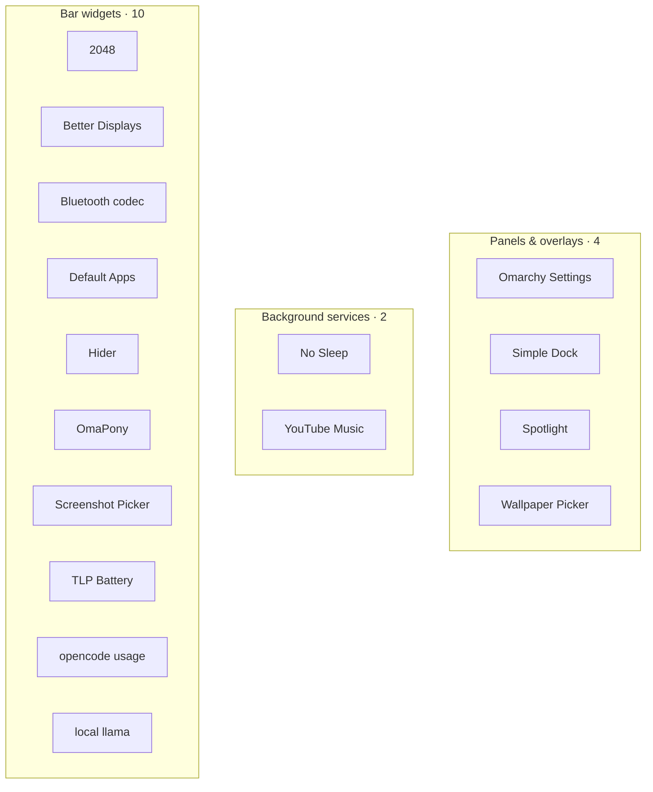

# Plugins

Sixteen [Omarchy](https://omarchy.org/) shell plugins — bar widgets, panels,
overlays and services, written in QML for Quickshell.

All sixteen live here, one subdirectory each.

## The map

Each plugin appears under its primary kind; the table lists every kind it registers.



| Plugin | Id | Kind | What it does |
| --- | --- | --- | --- |
| **Panels & overlays** | | | |
| [`custom-settings`](custom-settings/) · [Omarchy Settings](custom-settings/) | `nightdevil00.custom-settings` | `bar-widget, panel` | A graphical settings hub for Omarchy: Hyprland behaviour and monitors, the shell bar and plugins, idle and night light, updates, and a system summary. |
| [`simple.dock`](simple.dock/) · [Simple Dock](simple.dock/) | `simple.dock` | `overlay` | Centered autohiding app dock with pinned and running apps. |
| [`mihai.spotlight`](mihai.spotlight/) · [Spotlight](mihai.spotlight/) | `mihai.spotlight` | `overlay` | Spotlight-style launcher: fuzzy-search apps, find any file, and open URLs in your default browser. |
| [`mihai.picker`](mihai.picker/) · [Wallpaper Picker](mihai.picker/) | `wallpicker.grid` | `overlay, bar-widget` | Fullscreen grid overlay to pick a wallpaper from your Pictures folder. |
| **Background services** | | | |
| [`white.nights`](white.nights/) · [No Sleep](white.nights/) | `white.nights` | `service, bar-widget` | Block suspend and hibernate so the system stays on with the screen off. The idle cycle (screensaver, lock, display off) keeps running normally. |
| [`mihai.ytmusic`](mihai.ytmusic/) · [YouTube Music](mihai.ytmusic/) | `mihai.ytmusic` | `service, bar-widget` | YouTube Music as a bar-anchored Chromium app window, with playback that continues while the dropdown is hidden. |
| **Bar widgets** | | | |
| [`custom-2048`](custom-2048/) · [2048](custom-2048/) | `terminal.2048` | `bar-widget` | Theme-aware terminal 2048 that fills the screen. Pick a board size and join the tiles. |
| [`better.displays`](better.displays/) · [Better Displays](better.displays/) | `better.displays` | `bar-widget` | Per-monitor resolution, scale, position, transform and per-terminal font sizes from the bar. |
| [`bt.codecs`](bt.codecs/) · [Bluetooth codec](bt.codecs/) | `bt.codecs` | `bar-widget` | Shift Bluetooth audio fidelity: pick the A2DP codec or headset profile for each connected Bluetooth audio device. |
| [`setup.defaults`](setup.defaults/) · [Default Apps](setup.defaults/) | `setup.defaults` | `bar-widget` | Set the default terminal, editor, browser, video player and mail client from any installed app — not just the ones Custom DHH Distro ships defaults for. |
| [`plugin.hider`](plugin.hider/) · [Hider](plugin.hider/) | `plugin.hider` | `bar-widget` | Hide and show bar plugins with a single click. |
| [`yt-pony`](yt-pony/) · [OmaPony](yt-pony/) | `omapony` | `bar-widget` | Video & audio downloader with offline Whisper AI transcription, automatic subtitles, platform detection, and superkey link grab for Omarchy Linux. |
| [`pick.screenshot`](pick.screenshot/) · [Screenshot Picker](pick.screenshot/) | `pick.screenshot` | `bar-widget` | Quick screenshot region, fullscreen, or window. |
| [`tlp.battery`](tlp.battery/) · [TLP Battery](tlp.battery/) | `tlp.battery` | `bar-widget` | TLP-backed battery, power profile, and charge limit. |
| [`mihai.opencode-usage`](mihai.opencode-usage/) · [opencode usage](mihai.opencode-usage/) | `mihai.opencode-usage` | `bar-widget` | opencode session usage in a native Custom DHH Distro bar panel: today's prompts, sessions, and tokens, a seven-day chart, the per-model and per-agent breakdown, and all-time totals. |
| [`mihai.llama`](mihai.llama/) · [local llama](mihai.llama/) | `mihai.llama` | `bar-widget` | Boot and stop local llama.cpp model servers for opencode on demand. Nothing occupies RAM or VRAM until you click Load; the widget shows which model is resident (needs llama.cpp + model GGUFs — see its README). |

## Installing

```sh
git clone https://github.com/nightdevil00/Plugins.git
cd Plugins
./install.sh better.displays      # or ./install.sh with no arguments to pick
./install.sh --all                # install all sixteen
./install.sh --all --enable       # install and enable all
```

`install.sh` copies a plugin's subdirectory into `~/.config/omarchy/plugins/<id>` —
the layout `omarchy plugin add` produces — then rescans the shell and prints the
`omarchy plugin enable` command.

The install directory is named by **id**, which is not always the folder name:
`custom-2048` installs as `terminal.2048`, `custom-settings` as
`nightdevil00.custom-settings`, `mihai.picker` as `wallpicker.grid`, and `yt-pony`
as `omapony`. The script handles that.

Copying one by hand:

```sh
git clone https://github.com/nightdevil00/Plugins.git
cp -r Plugins/better.displays ~/.config/omarchy/plugins/better.displays
omarchy-shell shell rescanPlugins
omarchy plugin enable better.displays
```

## Updating

`omarchy plugin update` does not work for these plugins — it runs
`git fetch origin HEAD`, and an installed copy here has no git checkout of its own.
Use the script instead, which replaces the installed directory:

```sh
./install.sh --update better.displays    # one
./install.sh --all --update              # all sixteen
```

## Layout

```
Plugins/
  better.displays/
  bt.codecs/
  custom-2048/
  custom-settings/
  mihai.opencode-usage/
  mihai.llama/
  mihai.picker/
  mihai.spotlight/
  mihai.ytmusic/
  pick.screenshot/
  plugin.hider/
  setup.defaults/
  simple.dock/
  tlp.battery/
  white.nights/
  yt-pony/
```

Each subdirectory is self-contained: `manifest.json`, its QML/JS sources, its own
`README.md`, and a `preview.png` where one exists.

`mihai.llama` additionally needs llama.cpp and model GGUFs before it is useful;
its control script keeps all runtime state in `~/llama-serve`, outside the plugin
folder, so the shell's plugin reload is never tripped.

## Compatibility — Qt 6.12

Qt 6.12's QtQuick registers a built-in `Color` QML type. Once the shell imports it,
`Color.*` resolves to that type instead of the shell's palette singleton, so every
color binding quietly becomes `undefined` (omacom/omarchy#14560). The Omarchy
Qt 6.12 fix renames the shell's palette singleton to `ShellColor`, and these plugins
now use `ShellColor.*` to match. Run your shell with that fix in place — the
`omarchy-shell-fix-qt612` workaround or a newer omarchy that renames the singleton —
so the plugins load.

---
*`yt-pony` is a fork of [tonythesuperpony/omapony](https://github.com/tonythesuperpony) —
see its README for upstream credits.*
