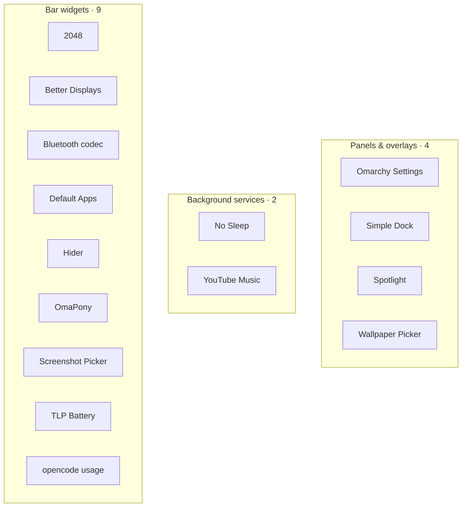

# Plugins

Fifteen [Omarchy](https://omarchy.org/) shell plugins — bar widgets, panels,
overlays and services, written in QML for Quickshell.

Every plugin lives in its own subdirectory here, and is also published as a
standalone repository so it can be installed with a single command (see
[Installing](#installing)).

## The map

Each plugin appears under its primary kind; the table below lists
every kind it registers.



| Plugin | Kind | What it does |
| --- | --- | --- |
| **Panels & overlays** | | |
| [`custom-settings`](custom-settings/) · [Omarchy Settings](custom-settings/) | `bar-widget, panel` | A graphical settings hub for Omarchy: Hyprland behaviour and monitors, the shell bar and plugins, idle and night light, updates, and a system summary. |
| [`simple.dock`](simple.dock/) · [Simple Dock](simple.dock/) | `overlay` | Centered autohiding app dock with pinned and running apps. |
| [`mihai.spotlight`](mihai.spotlight/) · [Spotlight](mihai.spotlight/) | `overlay` | Spotlight-style launcher: fuzzy-search apps, find any file, and open URLs in your default browser. |
| [`mihai.picker`](mihai.picker/) · [Wallpaper Picker](mihai.picker/) | `overlay, bar-widget` | Fullscreen grid overlay to pick a wallpaper from your Pictures folder. |
| **Background services** | | |
| [`white.nights`](white.nights/) · [No Sleep](white.nights/) | `service, bar-widget` | Block suspend and hibernate so the system stays on with the screen off. The idle cycle (screensaver, lock, display off) keeps running normally. |
| [`mihai.ytmusic`](mihai.ytmusic/) · [YouTube Music](mihai.ytmusic/) | `service, bar-widget` | YouTube Music as a bar-anchored Chromium app window, with playback that continues while the dropdown is hidden. |
| **Bar widgets** | | |
| [`custom-2048`](custom-2048/) · [2048](custom-2048/) | `bar-widget` | Theme-aware terminal 2048 that fills the screen. Pick a board size and join the tiles. |
| [`better.displays`](better.displays/) · [Better Displays](better.displays/) | `bar-widget` | Per-monitor resolution, scale, position, transform and per-terminal font sizes from the bar. |
| [`bt.codecs`](bt.codecs/) · [Bluetooth codec](bt.codecs/) | `bar-widget` | Shift Bluetooth audio fidelity: pick the A2DP codec or headset profile for each connected Bluetooth audio device. |
| [`setup.defaults`](setup.defaults/) · [Default Apps](setup.defaults/) | `bar-widget` | Set the default terminal, editor, browser, video player and mail client from any installed app — not just the ones Custom DHH Distro ships defaults for. |
| [`plugin.hider`](plugin.hider/) · [Hider](plugin.hider/) | `bar-widget` | Hide and show bar plugins with a single click. |
| [`yt-pony`](yt-pony/) · [OmaPony](yt-pony/) | `bar-widget` | Video & audio downloader with offline Whisper AI transcription, automatic subtitles, platform detection, and superkey link grab for Omarchy Linux. |
| [`pick.screenshot`](pick.screenshot/) · [Screenshot Picker](pick.screenshot/) | `bar-widget` | Quick screenshot region, fullscreen, or window. |
| [`tlp.battery`](tlp.battery/) · [TLP Battery](tlp.battery/) | `bar-widget` | TLP-backed battery, power profile, and charge limit. |
| [`mihai.opencode-usage`](mihai.opencode-usage/) · [opencode usage](mihai.opencode-usage/) | `bar-widget` | opencode session usage in a native Custom DHH Distro bar panel: today's prompts, sessions, and tokens, a seven-day chart, the per-model and per-agent breakdown, and all-time totals. |

## Installing

`omarchy plugin add` needs `manifest.json` at the **root** of the cloned repository,
so a plugin cannot be installed straight from a subdirectory of this repo. Each
plugin therefore has its own repository, and that is what the installer consumes:

```sh
omarchy plugin add https://github.com/nightdevil00/better.displays.git --enable
```

Swap the repository for any of the fifteen above. The subdirectories here are the
browsable source of truth; the standalone repositories are the installable units.

## Layout

```
Plugins/
  better.displays/
  bt.codecs/
  custom-2048/
  custom-settings/
  mihai.opencode-usage/
  mihai.picker/
  mihai.spotlight/
  mihai.ytmusic/
  pick.screenshot/
  plugin.hider/
  setup.defaults/
  simple.dock/
  tlp.battery/
  white.nights/
  yt-pony/
```

Each subdirectory is self-contained: `manifest.json`, its QML/JS sources, its own
`README.md`, and a `preview.png` where one exists.

---
*`yt-pony` is a fork of [tonythesuperpony/omapony](https://github.com/tonythesuperpony) —
see its README for upstream credits.*
