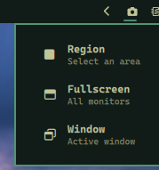

# Screenshot Picker — omarchy plugin

> Part of the **[Plugins](https://github.com/nightdevil00/Plugins)** collection — source: [`Plugins/pick.screenshot`](https://github.com/nightdevil00/Plugins/pick.screenshot/)

A bar widget that lets you pick screenshot mode: region, fullscreen, or window.



## Install

```bash
omarchy plugin add https://github.com/nightdevil00/pick.screenshot.git --enable
```

This clones the repo, validates the manifest, and prompts you to place the icon in your bar.

## Usage

Click the camera icon () in the bar to open the picker:

- **Region** — `omarchy-capture-screenshot region`
- **Fullscreen** — `omarchy-capture-screenshot fullscreen`
- **Window** — `omarchy-capture-screenshot windows`

Right-click the icon to take an instant default screenshot.

## Files

```
manifest.json       — plugin metadata
ScreenshotMenu.qml  — bar widget with popup menu
README.md           — this file
```
