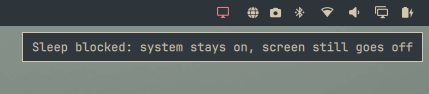

# white.nights

> Part of the **[Plugins](https://github.com/nightdevil00/Plugins)** collection — source: [`Plugins/white.nights`](https://github.com/nightdevil00/Plugins/white.nights/)

An [Omarchy](https://omarchy.org/) shell plugin that blocks suspend and
hibernate while leaving your normal idle cycle untouched: the screen still goes
to the screensaver, locks, and turns off — the system just stays on underneath.

A white night is a summer night when the sun barely dips below the horizon and
it never gets fully dark. Your machine stays awake all night, screen off.



## What it does

- Keeps the screensaver, lock, and display-off behavior exactly as configured
  (`idle.screensaver` / `idle.lock` in `~/.config/omarchy/shell.json`).
- Holds a `systemd-inhibit --mode=block` on `sleep`, `handle-lid-switch`,
  `handle-suspend-key`, and `handle-hibernate-key` while enabled, so suspend,
  hibernate, and lid-close sleep are refused.
- Shows a bar toggle to flip it on and off whenever you like. The enabled
  state persists across reboots.

Perfect for downloads, rendering, servers, or leaving the machine on overnight
without the screen burning.

## Requirements

- Omarchy (with the Quickshell-based shell and idle/lock plugins)
- `systemd-inhibit` (part of systemd, always present)

## Installation

Install straight from this repository with the Omarchy plugin installer. The
command clones the repo into `~/.config/omarchy/plugins/`, validates the
manifest, and (with `--enable`) places the toggle in your bar:

```bash
omarchy plugin install https://github.com/nightdevil00/white.nights --enable
```

`omarchy plugin install` is an alias for `omarchy plugin add`.

If you would rather add it without enabling it right away, drop `--enable`:

```bash
omarchy plugin install https://github.com/nightdevil00/white.nights
# then, when you're ready:
omarchy plugin enable white.nights
```

The first time you enable it, sleep blocking is off. Turn it on with the bar
icon or `omarchy-shell no-sleep enable`.

## Usage

Click the monitor icon (`󰍹`) in the bar to toggle sleep blocking. When active
the icon is highlighted and tooltips explain the state.

You can also control it from a terminal:

```bash
omarchy-shell no-sleep status      # current state
omarchy-shell no-sleep enable      # block suspend/hibernate
omarchy-shell no-sleep disable     # allow suspend/hibernate again
omarchy-shell no-sleep toggle      # flip the state
```

Verify the inhibitor is live with:

```bash
systemd-inhibit --list
# No Sleep (white.nights) ... mode=block
```

## How it works

The plugin is a `service` + `bar-widget` pair:

- `Service.qml` keeps a long-running `systemd-inhibit` process that holds a
  **block** inhibitor while the service is enabled. logind refuses every sleep
  request (suspend, hibernate, suspend-then-hibernate, hybrid) and ignores the
  lid/suspend keys while it is held. The state is persisted in
  `~/.local/state/omarchy/indicators/white.nights`.
- `BarWidget.qml` is the bar toggle that talks to the service.

Because sleep is blocked, logind never enters sleep, so Omarchy's pre-suspend
lock (`omarchy-sleep-lock.service`) simply never fires — there is nothing to
lock before. The screen still blanks through the normal idle → screensaver →
lock path.

## Notes

- While enabled, `systemctl suspend` and friends fail with "Operation
  inhibited". That is the point — disable it when you actually want to sleep.
- The block only lasts while the Omarchy shell is running. If you log out, the
  inhibitor is released and sleep behaves normally again.

## Uninstall

```bash
omarchy plugin remove white.nights
```

## License

[MIT](LICENSE)
